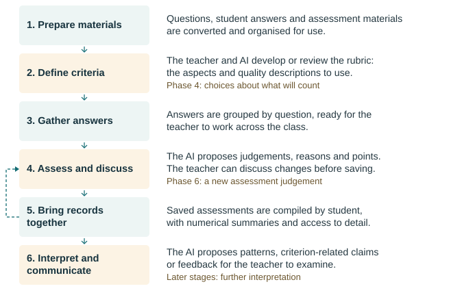

# Assessment Suite 0.8.0: assessment workflow

This guide follows an assessment through Assessment Suite 0.8.0, from source documents to student-level records. For each stage it says who does what, which material the activity uses and what it produces. It is written for researchers, technically interested teachers and developers who want to see how the work is carried out, and it complements the README, which explains the purpose and the design.

The route described is the main one: written answers organised by question. Where the guide describes what the teacher and the AI do, it describes the process the methodology asks for; where it describes what a tool does, it describes the implementation as inspected.

## From source documents to assessment records

Assessment Suite connects work on individual answers with consideration of a student's work across questions. The teacher first prepares usable material and criteria. The AI proposes assessments against those criteria, the teacher examines the proposals, and the tools save the submitted judgements and reasons. Reporting tools then reorganise the records by student.

The teacher works through an AI application, which manages the conversation and calls tools on two local MCP servers. The Python server handles document preparation, extraction and reporting. The TypeScript server supplies the assessment instructions and supports assessment, retrieval and saving. The model generates proposals from the material the application supplies.

The table gives the main activities and what each produces. It is an overview of responsibilities, not a sequence of calls that runs on its own.

| Activity | Teacher | AI model | Tools and resulting material |
|---|---|---|---|
| Prepare documents | Selects materials and checks extracted text | Uses the prepared material when supplied | Setup and conversion create source references and Markdown files |
| Locate answers | Examines questions and response boundaries | Analyses the supplied text and proposes structure | Question/boundary tools save configuration; preparation and annotation create marked working files |
| Define assessment criteria | Decides which aspects and qualities matter | Assists rubric review and development | Rubric tools load guidance and save supplied analysis |
| Group responses | Checks that responses belong to the right question | No new assessment judgement is needed for grouping | Extraction creates question files and assessment copies |
| Assess an answer | Examines, questions and revises the proposal | Proposes aspect judgements, points and reasons | Assessment tools return an answer and rubric, then save submitted assessment content |
| Compile records | Reviews format analysis and report previews | Assists examination of the assessment format | Format configuration enables parsing; report tools compile records by student and calculate summaries |
| Interpret and communicate | Examines broader conclusions and feedback | Proposes patterns, criterion links and feedback | Later tools load specified records and save the resulting text |

Rubric development can go on while material is being prepared. Applying a rubric requires the rubric and the answer; extracting responses requires usable question and boundary information. The later file dependencies are given in their own section below.



## Prepare and organise the material

Before any material reaches the AI application it must meet the input condition: PDFs and answers contain no personal data. The tools do not detect or remove identifiers. First trials use fabricated student answers.

The teacher identifies the questions, the answers and the assessment guidance. `scan_source_directory` lists the available files. `initialize_project` creates the assessment project, copies the selected materials and records where they came from. `convert_documents` extracts PDF text into Markdown under `02_markdown/` and copies other files unchanged. The teacher compares the extracted text with the source, looking for omitted passages, garbled text and lost context.

`phase2b_questions` returns the exam text and the instructions for identifying questions. `phase2c_boundaries` supports the analysis of where each response begins and ends, and `phase2d_students` the identification of students. Their save operations record the supplied results in the project configuration. The teacher checks that those results describe the actual material.

`phase3_prepare` creates working files for each student in `03_material/student_answers/`, with an identifier header and line indices. `phase3_annotate` inserts answer markers from the configured boundaries. `phase3_validate` and `phase3_file_edit` support checking and correcting the marked files. The teacher confirms that each marked span holds the complete intended response.

With question and boundary information in place, `extract_student_answers` groups the responses into question files in `05_answers_by_question/` and creates the copies in `06_analytic_assessment/` that assessment works on. The class's answers to one question can now be read together.

Sources: [preparation and annotation](../packages/assessment-data-mcp/src/assessment_data_mcp/tools/phase3_prepare.py#L300), [question extraction](../packages/assessment-data-mcp/src/assessment_data_mcp/tools/phase5_qfiles.py#L1115).

## Establish what counts as quality

The teacher examines whether an existing rubric captures what matters in the task, or develops one with AI assistance. An analytic rubric names the separate aspects of an answer, describes the qualities to look for in each, and allocates points.

`phase4b_rubric` loads the rubric, the exam questions and the [rubric-design methodology](../methodology/pedagogical/phase4_rubric_design_method.md) for examination through the application. Its save path records the resulting analysis in the project configuration. Saving records the teacher's decision about criteria; it does not make that decision.

`phase4c_save` stores a preparatory analysis of the student material as `student_report.md`. This is a working document for the teacher, distinct from the per-student reports produced after assessment, and neither extraction nor assessment depends on it.

Source: [rubric load and save](../packages/assessment-mcp/src/tools/phase4b_rubric.ts#L87).

## Examine an answer, revise the proposal and save it

`phase6_start` creates or resumes the assessment state, resolves the rubric section for the question and loads the available methodology. It returns the first student material and, when asked to, creates or reuses a dated working copy of the question file; later operations work on that active file. `phase6_read_next` returns the next unassessed answer with the rubric information and the progress so far. If the session's methodology has not been loaded, it returns a warning instead of a student.

The [assessment methodology](../methodology/pedagogical/phase6_assessment_method.md) instructs the AI to propose a judgement for each aspect of the rubric, with points, reasons drawn from the answer and a next-step comment. The teacher examines the proposal against the whole response.

### An illustrative assessment

The question, answer, rubric and exchange below are fabricated to show the process.

**Question:** Explain how roadworks can delay a bus.

**Rubric for this example:**

| Aspect | Description | Points and symbol |
|---|---|---|
| A: relevant condition | Identifies a roadwork-related restriction | 0: absent (–); 1: present (✓) |
| B: causal explanation | Connects the restriction to the bus delay | 0: no connection (–); 1: incomplete connection (✓); 2: an explicit causal chain (✓✓) |

**Fabricated answer:**

> Roadworks and traffic lights. One lane is closed, so cars queue and the bus takes longer.

**Initial AI proposal:** A receives 1 point for identifying a closed lane. B receives 0 points because the answer “lists causes without explaining them”. Proposed total: 1/3.

**Teacher examination:** “Your reason for B describes the first sentence. How does the second sentence connect lane closure, queuing and delay?”

**Revised assessment:** The second sentence explicitly connects all three. The teacher selects 2 points for B, retaining 1 point for A. The revised total is 3/3.

The assessment submitted to `phase6_write` contains this assessment object:

```json
{
  "aspects": [
    {
      "name": "A: relevant condition",
      "symbol": "✓",
      "points": 1,
      "comment": "Identifies the closed lane."
    },
    {
      "name": "B: causal explanation",
      "symbol": "✓✓",
      "points": 2,
      "comment": "Connects lane closure to queuing and a longer bus journey."
    }
  ],
  "totalPoints": 3,
  "maxPoints": 3,
  "nextStep": "Apply the same causal explanation to a different source of delay."
}
```

This is the `assessment` field of the call; the call also identifies the student and the active assessment file.

The tool inserts a Markdown assessment block into that student's section of the question file. For this example the readable part is:

```markdown
**A: relevant condition:** ✓ **1p** - Identifies the closed lane.
**B: causal explanation:** ✓✓ **2p** - Connects lane closure to queuing and a longer bus journey.

**TOTALPOÄNG: 3/3p**
**→ Nästa steg:** Apply the same causal explanation to a different source of delay.
```

The full block also carries the student identifier, format markers and metadata. The Swedish labels are what the current formatter writes.

Each aspect has its own symbol, points and comment; the next step belongs to the assessment as a whole. The saved record holds the submitted result and its reasons, not the initial proposal or the teacher's question.

Before writing, the tool checks the student and any existing assessment, validates the required fields and the point arithmetic, then writes the block and updates the progress. That is a check of the record's form, not of whether the judgement is defensible.

Sources: [assessment schema](../packages/assessment-mcp/src/server.ts#L252), [assessment formatter](../packages/assessment-mcp/src/types/assessment.ts#L145), [write handler](../packages/assessment-mcp/src/tools/phase6_write.ts#L80).

## Compile the assessments by student

Reporting reorganises the records without adding a judgement. Before the generator can extract and combine assessments it needs to recognise the format they were saved in.

`phase6_post_format` establishes that format in three steps. In load mode it returns the question-file names, a sample from the first file, the current configuration and the instructions. Through the application, the AI analyses the format and the teacher examines the proposed interpretation. The application then saves it with `confirmed=true`, which writes an `assessment_format` entry to `exam_config.yaml`. A project that already has a suitable entry does not need this repeated for every report.

The teacher then examines the preview from `generate_reports`, including any anomalies it reports, before requesting generation, which requires `confirmed=true`. The reporting tools parse the question files and write:

| File | What it contains or supports |
|---|---|
| `07_analytic_student/Analytic_{student_id}.md` | The student's compiled analytic assessment report |
| `complete_assessment/Complete_{student_id}.md` | The progressive report used by later interpretation and retrieval |
| `08_quantitative/Student_{student_id}_quantitative.json` | Numerical data produced by `quantitative_summary` |

The teacher checks that the expected questions, assessments and totals are all present. The numerical parser reads the summary table in the analytic report first and falls back to the assessed question files. `quantitative_summary` also writes its figures into the report material.

For the bus example, the student's report would now hold the 3/3 assessment and its reasons next to the same student's other question records.

Sources: [format configuration](../packages/assessment-mcp/src/tools/phase6_post_format.ts#L455), [report generation](../packages/assessment-data-mcp/src/assessment_data_mcp/phase7/generator.py#L148), [numerical parser](../packages/assessment-data-mcp/src/assessment_data_mcp/phase8/hybrid_parser.py#L25).

## Interpret the records and decide what to communicate

A report puts records together; the later methodology asks the teacher and the AI to make further judgements from them.

| Activity | AI contribution requested by the methodology | Teacher's examination | Intended output |
|---|---|---|---|
| Phase 9: interpret across answers | Propose subject-area patterns, recurring strengths, difficulties and tensions | Check proposed patterns against specific answers, including evidence that does not fit | A student-level interpretation |
| Phase 10: relate evidence to course criteria | Propose links between demonstrated performance and criteria, with reasons and uncertainty | Interpret the criteria in context and assess how far the available answers support each claim | Criterion indications with supporting reasoning |
| Phase 11: consider a grade decision, when relevant | Assemble evidence for a proposed decision | Consider sufficiency, alternatives and uncertainty | A reasoned decision document |
| Phase 12: prepare feedback | Connect patterns in the work to priorities and possible next actions | Check that the proposed priorities and advice follow from the evidence | A feedback working document for the teacher |
| Phase 13: consider the class | Propose shared difficulties and possible teaching responses | Examine whether the class evidence supports those patterns and responses | A class-level teacher summary |
| Phase 14: prepare student-facing feedback | Select and rewrite feedback for the student, as instructed by its methodology | Examine selection, wording and evidential support | A student-facing feedback document |

The single bus answer supports a judgement about that response. It cannot on its own show that the student consistently explains causal relationships. Phase 9 examines that possibility across the student's other answers, including cases that contradict it. Phase 10 asks a further question: which course criterion, if any, does that pattern give evidence for?

The instructions for each stage are in the methodology for [Phase 9](../methodology/pedagogical/phase9_generalization_method.md#L107), [Phase 10](../methodology/pedagogical/phase10_extrapolation_method.md#L11), [Phase 11](../methodology/pedagogical/phase11_grade_decision_method.md), [Phase 12](../methodology/pedagogical/phase12_feedback_method.md#L11), [Phase 13](../methodology/pedagogical/phase13_teacher_summary_method.md#L11) and [Phase 14](../methodology/pedagogical/phase14_student_feedback_method.md#L13).

### What the later tools load and save

`phase_start` loads the configured records, the methodology and the project context for the selected phase; the application supports the discussion that follows. `phase_complete` receives the resulting text, updates the student's progressive report for the student-level phases and writes a standalone phase file. Phase 13 writes a standalone class summary.

The table gives the assessment-data inputs in the registered configuration. Methodology, project information and, where available, the assessment purpose are loaded separately.

| Phase | Required assessment-data files | Optional assessment-data files |
|---|---|---|
| 9 | Phase 8 quantitative JSON; progressive report | None |
| 10 | Phase 9 generalisation; progressive report | None |
| 11 | Phase 10 extrapolation; progressive report | None |
| 12 | Phase 9 generalisation; Phase 10 extrapolation; progressive report | Phase 11 grade decision |
| 13 | None configured for automatic assessment-data loading | None |
| 14 | Progressive report; Phase 8 quantitative JSON | Phase 9 generalisation |

A phase does not start if a required input cannot be read; a missing optional input is passed as null. Phase 13 has no assessment-data files configured, so reading the class material is left to the model and the application.

In two places the methodology and the configuration disagree, and the configuration is what the tool enforces. Phase 12's methodology allows feedback to be prepared from Phase 9 alone when Phase 10 has not been completed, but the configured start requires the Phase 10 file. Phase 14's methodology names Phase 12 as its sole input, but its configured start loads the files listed above. The two have not been reconciled.

Sources: [configured inputs](../packages/assessment-mcp/src/core/phase_configs.ts#L10), [generic start and completion](../packages/assessment-mcp/src/core/generic_phase_orchestrator.ts#L104).

## Revisit an assessment and follow through changes

`hermeneutic_read` retrieves selected question sections from the progressive report, so the teacher can go from a broad claim back to the saved assessment and its reasons. Retrieval does not reopen the original PDF or recover the assessment dialogue. A record on disk reaches the model only when a tool loads it or the teacher supplies it.

When the teacher revises an earlier assessment, the later records do not follow. `phase6_write` updates the question summary, but no tool refreshes the student reports or the interpretations built on them. Reports are rebuilt from the saved assessments rather than updated in place: rebuilding an existing analytic report requires an explicit overwrite, and rebuilding the progressive report replaces it, including anything a later phase has written into it. The teacher decides which outputs are out of date, preserves what a rebuild would remove, and regenerates.

A change to the methodology reaches different stages differently. The assessment stage resolves its instructions from the assessment project, so an edit to the project's own methodology takes effect there. The later phases use a shared loader that reads from `METHODOLOGY_PATH` or the installation directory and keeps the content in memory, so an edit to a project copy does not reach them.

Sources: [retrieval](../packages/assessment-mcp/src/tools/hermeneutic_read.ts#L35), [report writes](../packages/assessment-data-mcp/src/assessment_data_mcp/phase7/generator.py#L215), [methodology loader](../packages/assessment-mcp/src/core/methodology_loader.ts#L25).
